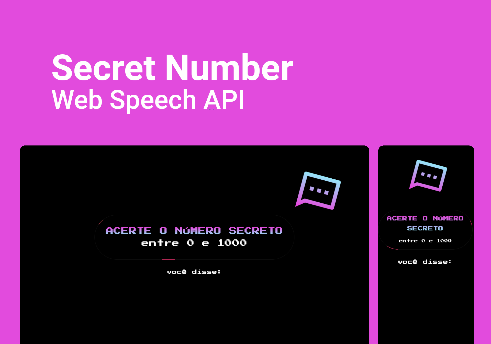

# Secret Number - Web Speech API

> A small game made with Web Speech API, using its constructor to create a new SpeechRecognition object, which has several event handlers available to detect when speech is input through the device's microphone.
